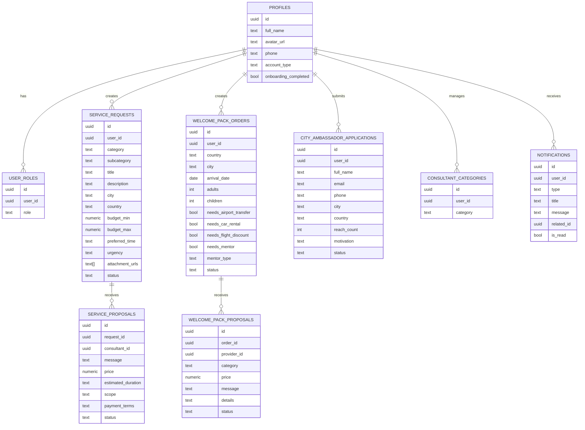
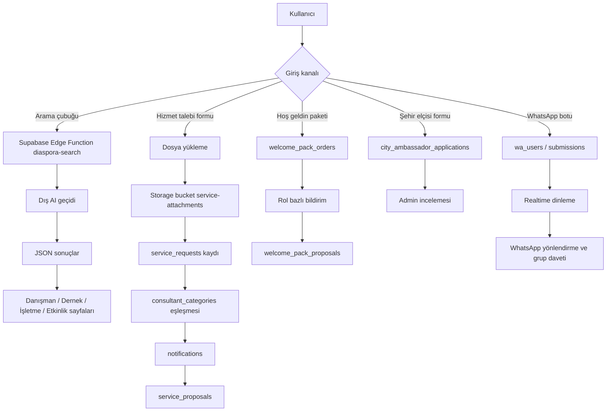

# CorteQS için kullanıcıya dönük RAG veritabanı dokümantasyonu

**Yönetici özeti:** İncelenen iki repo, `ubterzioglu/corteqs` ve `ubterzioglu/corebot`, bugün itibarıyla klasik anlamda bir “RAG veritabanı”ndan çok; kullanıcıya açık katalog verileri, Supabase üstünde çalışan operasyonel tablolar, Edge Function tabanlı AI arama/yardımcı akışları ve WhatsApp botu ile veri toplama süreçlerinin birleşiminden oluşan bir mimari gösteriyor. En önemli bulgu şudur: kullanıcı araması için çalışan akış mevcut olsa da, açık biçimde tanımlanmış bir vektör şeması, embedding kolonu, retrieval index’i veya gerçek belge-parça alma zinciri incelenen dosyalarda görünmüyor; buna karşılık `AI arama / vektör embedding` ihtiyacı proje dokümantasyonunda eksik veya planlı özellik olarak açıkça geçiyor. Bu yüzden aşağıdaki belge, mevcut sistemi dürüstçe “bugünkü durum” üzerinden anlatır; klasik RAG’de eksik kalan alanları **belirtilmemiş** diye işaretler ve makul varsayımları ayrıca listeler. fileciteturn19file0L1-L1 fileciteturn42file0L1-L1 fileciteturn43file0L1-L1

## Kapsam ve ana bulgu

Bu belge, yalnızca `ubterzioglu/corteqs` ve `ubterzioglu/corebot` depolarındaki CorteQS ile ilgili dosyalardan üretildi. Etkin bağlayıcılar olarak GitHub ve Google Drive tarandı; ancak teknik şema, kullanıcı akışı ve davranışın büyük bölümü GitHub içeriğinde somutlaştığı için ana kaynak GitHub oldu. Google Drive, bu çalışmada ikincil bağlam kaynağı olarak değerlendirildi; kullanıcı isteği doğrultusunda dokümanın omurgası repo içerikleri üzerinden kuruldu.

En kritik mimari sonucu en başta netleştirmek gerekir: kullanıcıya görünen “arama” deneyimi, `src/components/DiasporaSearchBar.tsx` içinden bir Supabase Edge Function çağrısına dayanıyor; bu Edge Function da sabit bir sistem prompt’u ile bir dış AI geçidine istek atıyor ve 3–6 sonuçluk JSON dönüyor. Kod içinde belge parçası alma, embedding üretme, vektör benzerliği, chunking ya da retrieval ranking yapan bir veritabanı katmanı görülmüyor. Arama sonucu nesnesi de yalnızca `title`, `description`, `category`, `location`, `type`, `icon` alanlarından oluşuyor. Bu nedenle mevcut sistem, kullanıcı açısından “AI destekli arama” gibi davranıyor; fakat klasik, belgeye dayalı RAG DB olarak tanımlanması bugün için teknik olarak tam karşılık bulmuyor. `docu/guide.html` ve `docu/status.html` içinde de `AI Arama` ve özellikle `vektör embedding` tarafının eksik / planlı olduğu açıkça yazılmış durumda. fileciteturn20file0L1-L1 fileciteturn19file0L1-L1 fileciteturn42file0L1-L1 fileciteturn43file0L1-L1

Kullanıcıya sunulan ürün yüzeyi ise daha geniştir. Uygulamanın router’ı; danışmanlar, dernekler, işletmeler, etkinlikler, WhatsApp grupları, blogger/vlogger’lar, relokasyon motoru, şehir elçileri, şehir haberleri, profil ve yönetim ekranları gibi çok sayıda sayfa tanımlar. Ana sayfa da AI arama çubuğunu; danışman kategorileri, öne çıkan danışmanlar, dernekler, işletmeler ve etkinliklerle birlikte yükler. Repo içeriği, bu yüzden tek bir “arama veritabanı”ndan ziyade diaspora ağı için birleşik dizin + operasyon + etkileşim katmanı olarak okunmalıdır. fileciteturn47file0L1-L1 fileciteturn45file0L1-L1

## Platformın amacı ve kullanıcıya sunduğu veri

CorteQS’in kullanıcıya dönük amacı, Türk diasporasının yurt dışındaki hizmetleri, profesyonelleri, kurumları, işletmeleri, etkinlikleri ve topluluk kanallarını bulmasını kolaylaştırmak; ayrıca hizmet talebi, hoş geldin paketi, şehir elçiliği ve WhatsApp onboarding gibi akışlarla etkileşime girmesini sağlamaktır. AI arama asistanı prompt’u doğrudan “Türk diasporasına yurt dışındaki hizmetleri bulmalarında yardımcı oluyorsun” ifadesini kullanır ve sonuç kategorilerini konsolosluk, doktor, vize/göçmenlik, Türk marketi, iş ilanları, danışman, dernek, işletme ve etkinlik olarak sınırlar. Arama çubuğundaki hızlı aksiyonlar da aynı niyeti destekler: Konsolosluk, Doktor, Hastane, Vize & Göçmenlik, Türk Marketi, İş İlanları, Hoşgeldin Paketi ve Taşınma Motoru. fileciteturn19file0L1-L1 fileciteturn20file0L1-L1

Kullanıcıya sunulan içeriklerin bugünkü en görünür veri kaynağı `src/data/mock.ts` dosyasıdır. Burada açıkça tanımlanmış arayüzler ve örnek kayıtlar bulunur. Bu dosya, üretim veritabanı yerine statik veya demo/seed niteliğinde bir katalog veri kümesini temsil ediyor görünmektedir. Repo içinde danışmanlar, dernekler, WhatsApp grupları, etkinlikler, işletmeler, blogger/vlogger’lar, şehir elçileri, boost paketleri ve hedef kitle segmentleri için ayrı veri yapıları vardır. Aynı dosya, ülke listeleri ve kategori temelli erişim segmentlerini de içerir. Bu nedenle “veri dahil mi?” sorusunun dürüst cevabı şudur: **Evet, kullanıcıya gösterilen zengin içerik kümeleri dahil; fakat bunların önemli bir bölümü şu an canlı DB yerine kod içi mock veri olarak temsil ediliyor.** fileciteturn53file0L1-L1

Aşağıdaki tablo, kullanıcıya gerçekten görünen ana veri kümelerini ve bunların bugünkü temsillerini özetler:

| Veri kümesi | Kullanıcıya görünen amaç | Temsil biçimi | Örnek temel alanlar | Kaynak dosya |
|---|---|---|---|---|
| Danışmanlar | Uzman kişileri bulma | Statik katalog / mock veri | `id`, `name`, `role`, `category`, `country`, `city`, `rating`, `bio`, `website`, `whatsapp`, `languages`, `specialties` | `src/data/mock.ts` fileciteturn53file0L1-L1 |
| Dernekler / kurumlar | Topluluk ve kurumsal yapı bulma | Statik katalog / mock veri | `id`, `name`, `type`, `country`, `city`, `members`, `events`, `description`, `website`, `founded` | `src/data/mock.ts` fileciteturn53file0L1-L1 |
| WhatsApp grupları | Topluluk kanallarına katılım | Statik katalog / mock veri | `id`, `name`, `category`, `country`, `city`, `members`, `description`, `link`, `university` | `src/data/mock.ts` fileciteturn53file0L1-L1 |
| Etkinlikler | Networking, eğitim, kültür vb. keşfi | Statik katalog / mock veri | `id`, `title`, `description`, `date`, `time`, `country`, `city`, `location`, `type`, `category`, `organizer`, `attendees`, `price`, `tags`, `featured` | `src/data/mock.ts` fileciteturn53file0L1-L1 |
| İşletmeler | İş fırsatı, franchise, ilan | Statik katalog / mock veri | `id`, `name`, `sector`, `country`, `city`, `description`, `website`, `founded`, `employees`, `offerings`, `openPositions`, `contactEmail` | `src/data/mock.ts` fileciteturn53file0L1-L1 |
| Blogger / vlogger | İçerik üreticileri ve işbirlikleri | Statik katalog / mock veri | `id`, `name`, `type`, `country`, `city`, `bio`, `followers`, `specialties`, `blogPosts`, `vlogs`, `adCollaboration` | `src/data/mock.ts` fileciteturn53file0L1-L1 |
| Şehir elçileri | Yerel topluluk liderleri | Statik katalog + başvuru tablosu | katalogta `usersOnboarded`, `eventsOrganized`; DB’de `reach_count`, `motivation`, `weekly_hours` vb. | `src/data/mock.ts`, `src/pages/CityAmbassadors.tsx`, `supabase/migrations/20260329082645_21fc76a1-33dc-422c-a7e6-1afadb98d2c2.sql` fileciteturn53file0L1-L1 fileciteturn63file0L1-L1 fileciteturn23file0L1-L1 |
| Hizmet talepleri | Kullanıcının danışmanlardan teklif alması | Canlı DB tablosu | `category`, `subcategory`, `title`, `description`, `city`, `country`, `budget_min`, `budget_max`, `preferred_time`, `urgency`, `attachment_urls`, `status` | `supabase/migrations/...9bf32535....sql`, `src/components/ServiceRequestForm.tsx`, `src/integrations/supabase/types.ts` fileciteturn16file0L1-L1 fileciteturn59file0L1-L1 fileciteturn28file0L1-L1 |
| Hoş geldin paketi emirleri | Relokasyon hizmet teklifleri | Canlı DB tablosu | `country`, `city`, `arrival_date`, `adults`, `children`, `has_pet`, `needs_*`, `mentor_type`, `notes`, `status` | `supabase/migrations/...1c639b90....sql`, `src/components/WelcomePackOrderForm.tsx`, `src/integrations/supabase/types.ts` fileciteturn25file0L1-L1 fileciteturn60file0L1-L1 fileciteturn28file0L1-L1 |
| WhatsApp onboarding kayıtları | Bot ile lead / profil toplama | Bot tarafında DB tabloları, şema tam görünmüyor | `wa_users`, `wa_messages`, `wa_tasks`, `submissions` | `corebot/index.js`, `corebot/user-flow.html` fileciteturn30file0L1-L1 fileciteturn32file0L1-L1 |

Burada özellikle dikkat edilmesi gereken nokta şudur: proje içinde **birden fazla kategori sözlüğü** vardır. AI arama prompt’u başka, danışman kategorileri başka, hizmet talebi kategorileri ise biraz daha farklı bir küme kullanır. Kullanıcı açısından bu, arama sonucu kategorisi ile profil yönetimindeki kategori adlarının bire bir eşleşmeyebileceği anlamına gelir. Bu eşlemeyi ürün dokümantasyonunda açıkça göstermek önemlidir. fileciteturn19file0L1-L1 fileciteturn54file0L1-L1 fileciteturn59file0L1-L1 fileciteturn61file0L1-L1

## Veri modeli ve alanlar

Supabase tarafında somut olarak görülen ve kullanıcı işlemlerini gerçekten taşıyan veri modeli; `profiles`, `user_roles`, `service_requests`, `service_proposals`, `notifications`, `consultant_categories`, `city_ambassador_applications`, `welcome_pack_orders` ve `welcome_pack_proposals` tablolarından oluşuyor. `profiles` tablosu temel kullanıcı bilgilerini (`full_name`, `avatar_url`, `phone`) ve onboarding sonrasında kullanılan `account_type` ile `onboarding_completed` alanlarını taşır. `user_roles` tarafında `user`, `consultant`, `association`, `blogger`, `admin`, sonradan eklenen `business` ve `ambassador` rollerini görebiliyoruz. Yeni kullanıcı geldiğinde `handle_new_user()` trigger’ı profil yaratır ve varsayılan `user` rolü ekler. fileciteturn22file0L1-L1 fileciteturn27file0L1-L1 fileciteturn28file0L1-L1

Onboarding ekranı da bu veri modelini doğrudan kullanıcıya yansıtır. Kullanıcı altı hesap türünden birini seçer: bireysel kullanıcı, danışman, işletme, kuruluş/dernek, blogger/vlogger ve şehir elçisi. Kodda, seçilen rol `user_roles` tablosuna eklenir; ardından `profiles.account_type` güncellenir ve onboarding tamamlanmış işaretlenir. Bu akış, kullanıcı dokümantasyonunda “hesap türü = erişim ve görünürlük seviyesi” olarak anlatılmalıdır. fileciteturn49file0L1-L1

Hizmet talebi ve teklif modeli, kullanıcıların danışmanlardan cevap alması için kurulmuştur. `service_requests` isteğin sahibi, kategori, başlık, açıklama, konum, bütçe, tercih edilen zaman, aciliyet ve ek dosya URL’lerini taşır; `service_proposals` ise ilgili isteğe danışman tarafından iletilen mesaj, fiyat, tahmini süre, kapsam, ödeme koşulları ve teklif durumu alanlarını içerir. `consultant_categories` tablosu bir danışmanın hizmet verdiği alanları tutar; yeni hizmet talebi oluştuğunda bir trigger ilgili kategorideki danışmanlara `notifications` kaydı üretir. Kullanıcı açısından bu, “kategori seçimi yalnızca profil etiketi değil; taleplerin kime düşeceğini belirleyen eşleştirme anahtarıdır” demektir. fileciteturn16file0L1-L1 fileciteturn24file0L1-L1 fileciteturn61file0L1-L1 fileciteturn28file0L1-L1

Hoş geldin paketi akışı, relokasyon odaklı ikinci bir işlem modeli oluşturur. `welcome_pack_orders` tablosu ülke, şehir, geliş tarihi, yetişkin/çocuk sayısı, evcil hayvan, bebek koltuğu, havaalanı transferi, araç kiralama, uçuş indirimi, mentör ihtiyacı ve notlar gibi alanları tutar. `welcome_pack_proposals` ise işletme veya danışmanların sunduğu kategori, fiyat, mesaj ve detayları taşır. Trigger ile yeni order açıldığında uygun rollerdeki sağlayıcılara bildirim gider; ayrıca `welcome_pack_proposals` real-time yayına eklenmiştir. Kullanıcı açısından bu modül, “tek form gönder, birden fazla sağlayıcıdan teklif topla” mantığında çalışır. fileciteturn25file0L1-L1 fileciteturn60file0L1-L1

Şehir elçisi başvuruları da ayrı bir veri nesnesidir. Başvuru formu; ad-soyad, e-posta, telefon, şehir, ülke, ulaşabileceği kişi sayısı, ağ açıklaması, son dönemde düzenlediği etkinlikler, tanıdığı profesyoneller, ilk hafta planı, haftalık ayırabileceği saat ve motivasyon gibi alanlar toplar. Migration tarafında da aynı alan seti görülür. Bu da ürün içinde sadece “katalog verisi” değil, başvuru ve değerlendirme verisi de tutulduğunu gösterir. fileciteturn63file0L1-L1 fileciteturn23file0L1-L1 fileciteturn28file0L1-L1

Aşağıdaki tablo, kullanıcı açısından en kritik alan kümelerini tek yerde toplar:

| Modül | Zorunlu alanlar | Önemli opsiyonel alanlar | Kullanıcı sonucu |
|---|---|---|---|
| Hesap / onboarding | `full_name`, e-posta, şifre, hesap türü | telefon, avatar, `account_type` | Profil oluşturma ve rol seçimi fileciteturn48file0L1-L1 fileciteturn49file0L1-L1 |
| Hizmet talebi | kategori, başlık, açıklama | alt kategori, şehir, ülke, bütçe aralığı, tercih zamanı, aciliyet, dosya ekleri | Danışman teklifleri alma fileciteturn59file0L1-L1 fileciteturn16file0L1-L1 |
| Danışman teklifi | `request_id`, `consultant_id`, mesaj | fiyat, süre, kapsam, ödeme şartı | Kullanıcının teklifleri karşılaştırması fileciteturn16file0L1-L1 |
| Hoş geldin paketi | ülke, geliş tarihi | şehir, kişi sayısı, pet, transfer, araç kiralama, mentör, notlar | Birden çok sağlayıcıdan öneri alma fileciteturn60file0L1-L1 fileciteturn25file0L1-L1 |
| Şehir elçisi başvurusu | `full_name`, `email`, `phone`, `city`, `country` | erişim ağı, etkinlik deneyimi, motivasyon, ilk hafta planı | Başvuru inceleme süreci fileciteturn63file0L1-L1 fileciteturn23file0L1-L1 |
| AI arama sonucu | sorgu metni | ülke filtresi | 3–6 JSON sonuç, rota bazlı yönlendirme fileciteturn19file0L1-L1 fileciteturn20file0L1-L1 |

Aşağıdaki mermaid diyagramı, kullanıcıya anlatmak için uygun bir “önerilen” varlık ilişkisi görünümü sunar:

## Veri girişi ve besleme akışı

Mevcut repo durumuna göre CorteQS’e veri girişinin üç ana kaynağı vardır. Birincisi, kod içine gömülü katalog verileri (`src/data/mock.ts`) üzerinden kullanıcıya doğrudan sunulan içeriklerdir. Bu katman; danışman, dernek, işletme, etkinlik, WhatsApp grubu, blogger/vlogger ve şehir elçisi kayıtlarının ilk görünür yüzeyini oluşturur. İkincisi, kullanıcı formlarından gelen operasyonel kayıtlar — hizmet talebi, hoş geldin paketi, şehir elçisi başvurusu ve hesap/onboarding verileri — Supabase tablolarına yazılır. Üçüncüsü, `corebot` deposundaki WhatsApp botu; kullanıcıdan sohbet içinde kayıt toplar, bunları `wa_users` ve `submissions` gibi tablolara işler, ardından Realtime ile yeni kayıtları dinler ve WhatsApp gruplarına veya takip akışlarına yönlendirir. fileciteturn53file0L1-L1 fileciteturn59file0L1-L1 fileciteturn60file0L1-L1 fileciteturn63file0L1-L1 fileciteturn30file0L1-L1 fileciteturn32file0L1-L1

Hizmet talebi akışında kullanıcı, kategori ve başlık/açıklama gibi zorunlu alanları doldurur; en fazla 5 dosya yükleyebilir; dosyalar önce `service-attachments` bucket’ına çıkarılır, sonra kamuya açık URL’leri `service_requests.attachment_urls` içine yazılır. Kaydın oluşturulmasından sonra ilgili kategorideki danışmanlara bildirim tetiklenir. Bu akış, bugünkü repo bazında “ingestion pipeline”ın en net görülen parçasıdır. fileciteturn59file0L1-L1 fileciteturn16file0L1-L1 fileciteturn24file0L1-L1

Hoş geldin paketi akışı benzer biçimde işler ama veri modeli farklıdır. Kullanıcı relokasyon ihtiyaçlarını formdan girer; kayıt `welcome_pack_orders` tablosuna yazılır; sonrasında işletme ve danışman rolleri için bildirim oluşturulur; teklifler `welcome_pack_proposals` üzerinden akar. Burada da ingestion biçimi forma dayalı ve yapılandırılmıştır; serbest belge yükleme ya da bilgi parçalayıp indeksleme yaklaşımı yoktur. fileciteturn60file0L1-L1 fileciteturn25file0L1-L1

`corebot` tarafında ise ingestion daha çok konuşma tabanlıdır. WhatsApp kullanıcısı menüden kayıt akışını seçer; kategori, ad-soyad, ülke, şehir, kuruluş, ilgi alanı, e-posta, telefon, keşif kaynağı, referral kodu, arz/talep notu, WhatsApp grubu ilgisi ve gizlilik onayı gibi alanları sohbet içinde verir. Tamamlanan kayıt `submissions` tablosuna yazılır. Kullanıcı form üzerinden veya bot üzerinden gelmişse, bot `submissions` tablosunda `whatsapp_interest = true` ve `status = 'new'` filtreli yeni kayıtları Realtime ile izleyip ilgili WhatsApp mesajını tetikler. Bu nedenle CorteQS veri besleme tarafı yalnızca web formu değil, aynı zamanda sohbet tabanlı onboarding de içerir. fileciteturn30file0L1-L1 fileciteturn31file0L1-L1 fileciteturn32file0L1-L1

Aşağıdaki tablo, kullanıcıya anlatılabilecek en pratik ingestion özetidir:

| Akış | Girdi kanalı | Beklenen format | Yazıldığı yer | Sonraki adım |
|---|---|---|---|---|
| AI arama | Arama kutusu / hızlı buton | Serbest metin + opsiyonel ülke filtresi | DB’ye yazım görünmüyor; Edge Function çağrısı | 3–6 JSON sonuç ve rota yönlendirmesi fileciteturn20file0L1-L1 fileciteturn19file0L1-L1 |
| Hizmet talebi | Web formu | Yapılandırılmış form + opsiyonel dosya | `service_requests`, `service-attachments`, ardından `notifications` | Danışman teklifleri ve bildirimler fileciteturn59file0L1-L1 fileciteturn16file0L1-L1 fileciteturn24file0L1-L1 |
| Hoş geldin paketi | Web formu / modal | Yapılandırılmış relokasyon formu | `welcome_pack_orders`, ardından `notifications` ve `welcome_pack_proposals` | Sağlayıcılardan teklif toplama fileciteturn60file0L1-L1 fileciteturn25file0L1-L1 |
| Şehir elçisi | Başvuru formu | Yapılandırılmış başvuru formu | `city_ambassador_applications` | Yönetici incelemesi fileciteturn63file0L1-L1 fileciteturn23file0L1-L1 |
| WhatsApp onboarding | Sohbet akışı | Menü + adım adım cevap | `wa_users`, `wa_messages`, `wa_tasks`, `submissions` | İleri yönlendirme, grup daveti, insan desteği fileciteturn30file0L1-L1 fileciteturn32file0L1-L1 |
| Statik katalog içerikleri | Kod içi veri | TypeScript nesneleri | `src/data/mock.ts` | Listeleme / detay sayfaları fileciteturn53file0L1-L1 |

Kullanıcıya dönük dokümantasyonda kullanılabilecek öneri diyagramı şudur:

Repo içinde bulunan komut ve komut parçaları da aşağıdaki gibi özetlenebilir:

| Komut | Nerede geçti | Amaç |
|---|---|---|
| `npm run dev` | `AGENTS.md` | Geliştirme sunucusu fileciteturn40file0L1-L1 |
| `npm run build` | `AGENTS.md` | Production build fileciteturn40file0L1-L1 |
| `npm run lint` | `AGENTS.md` | ESLint kontrolü fileciteturn40file0L1-L1 |
| `npm run test` | `AGENTS.md`; `corebot/package.json` | Test çalıştırma fileciteturn40file0L1-L1 fileciteturn29file0L1-L1 |
| `npm run test:watch` | `AGENTS.md` | Test izleme modu fileciteturn40file0L1-L1 |
| `npm start` | `corebot/package.json` | WhatsApp botunu başlatma fileciteturn29file0L1-L1 |
| `cp .env.example .env` | `DEPLOY.md`, `scripts/deploy.sh` | Ortam dosyasını hazırlama fileciteturn33file0L1-L1 fileciteturn36file0L1-L1 |
| `./scripts/deploy.sh` | `DEPLOY.md` | Manuel dağıtım script’i fileciteturn33file0L1-L1 |
| `docker-compose -f docker-compose.coolify.yml up -d --build` | `DEPLOY.md` | Coolify / Docker Compose dağıtımı fileciteturn33file0L1-L1 |
| `curl http://your-domain/health` | `DEPLOY.md` | Health check testi fileciteturn33file0L1-L1 |

## Arama davranışı ve kullanım örnekleri

Kullanıcı araması, `supabase.functions.invoke("diaspora-search", { body: { query, country }})` çağrısı ile çalışır. Arama çubuğu boş sorguyu kabul etmez; Enter veya “Ara” butonu ile tetiklenir; ayrıca “Konsolosluk”, “Doktor”, “Hastane”, “Vize danışmanı”, “Türk marketi” ve “İş ilanları” gibi hazır aramalar vardır. Kullanıcı ülke filtresinde “all” seçmemişse seçili ülke üstten geçiriliyor. Bu, arama davranışının klasik filtreli arama + istem tabanlı AI sentezi karışımı olduğunu gösterir. fileciteturn20file0L1-L1

Edge Function içindeki sistem prompt’u, sorguyu analiz edip sadece istenen JSON formatını döndürmesini, 3–6 sonuç üretmesini, sonuçları en alakalıdan aza sıralamasını ve Türkçe konuşmasını ister. Dönen her sonuç için yalnızca başlık, açıklama, kategori, konum, tip ve ikon alanı beklenir. Sonuç tipleri `consultant`, `association`, `business` ve `event` ile sınırlıdır; arayüz de bu tipe göre ilgili sayfaya yönlendirir. Bunun önemli kullanıcı etkisi şudur: **arama bugün belge tabanlı “kanıtlı cevap” sistemi değil, rota üreten AI öneri listesi sistemidir.** Ayrıca prompt’ta “Konsolosluk” ve “Doktor” gibi sonuç kategorileri bulunsa da rota eşlemesi dört tip üzerinden yapıldığı için sonuç kategorisi ile yönlendirme tipi bire bir aynı kavram değildir. fileciteturn19file0L1-L1 fileciteturn20file0L1-L1

Bu bağlamda, kullanıcıya dönük örnek sorgular aşağıdaki gibi belgelendirilebilir:

| Amaç | Örnek sorgu | Beklenen davranış |
|---|---|---|
| Konsolosluk bulma | `En yakın konsolosluk nerede?` | AI arama, seçili ülkeye göre Türkçe sonuç listesi döndürür; uygun tipe göre ilgili sayfaya yönlendirir. fileciteturn20file0L1-L1 fileciteturn19file0L1-L1 |
| Uzman bulma | `Vize danışmanı bul` | Danışman veya ilişkili işletme sonucu gelebilir. fileciteturn20file0L1-L1 fileciteturn19file0L1-L1 |
| İş/kurum arama | `Türk marketi` | İşletme odaklı sonuçlar beklenir. fileciteturn20file0L1-L1 |
| Etkinlik keşfi | `Berlin’de networking etkinliği` | Etkinlik rotalarına giden öneriler üretilebilir. `events` dataset’i böyle içerikleri besleyebilir, fakat retrieval zinciri belirtilmemiştir. fileciteturn53file0L1-L1 fileciteturn19file0L1-L1 |
| Profil bazlı destek | `Taşınma için yardım istiyorum` | AI arama + relokasyon motoru akışlarına yönlendirme olabilir. `relocation-chat` ayrı bir AI fonksiyondur. fileciteturn20file0L1-L1 fileciteturn58file0L1-L1 |

WhatsApp botu için kullanıcı komutları da son kullanıcı belgesine özellikle eklenmelidir, çünkü bunlar doğrudan sahadaki kullanım desenidir:

| Komut / cevap | Etki |
|---|---|
| `1`, `2`, `3`, `4` | Ana menüde hızlı yönlendirme, kayıt/profil, detaylı başvuru, insanla görüşme seçeneklerini açar. fileciteturn30file0L1-L1 |
| `m` / `menü` / `menu` | Her adımdan ana menüye döner. Testler bunu doğrular. fileciteturn30file0L1-L1 fileciteturn31file0L1-L1 |
| `geç` | Opsiyonel alanları atlar. fileciteturn30file0L1-L1 fileciteturn31file0L1-L1 |
| `onaylıyorum` / `hayır` | Gizlilik onayı ve kayıt tamamlanması üzerinde etkilidir. Onay olmadan kayıt tamamlanmaz. fileciteturn30file0L1-L1 fileciteturn31file0L1-L1 |
| `reset` | Akışı baştan başlatır. fileciteturn30file0L1-L1 fileciteturn32file0L1-L1 |

“Search / indexing behavior” başlığı altında kullanıcıya açıkça şu not düşülmelidir: bugünkü repo görüntüsünde ters indeks, full text index, vektör index veya embedding alanı tanımı bulunmadığı için **indeksleme davranışı belirlenmemiştir**. Katalog verileri `mock.ts` içinde, işlem verileri ise Supabase tablolarında duruyor; AI cevaplama katmanı ise harici model çağrısı ile sonuç sentezliyor. Klasik RAG’de beklenen retrieval-and-grounding zincirinin nasıl kurulacağı bu repo kesitinde **belirtilmemiştir**. Üstelik proje rehberinde `AI arama` ve özellikle `vektör embedding` açık bir eksik olarak not edilmiştir. fileciteturn53file0L1-L1 fileciteturn19file0L1-L1 fileciteturn42file0L1-L1

## Erişim, operasyon ve bakım

Erişim kontrolü tarafında CorteQS, açık şekilde Supabase RLS kullanıyor. `profiles` tablosunda kullanıcılar kendi profilini okuyup güncelleyebilir; ayrıca `anon` rolü için “Public can view profiles” politikası tanımlanmıştır. `service_requests`’te kullanıcılar kendi taleplerini oluşturabilir/görebilir/güncelleyebilir; danışmanlar ise yalnızca `open` durumundaki talepleri ve yalnızca `consultant` rolü varsa görür. `service_proposals`’ta danışman kendi teklifini oluşturur ve görür; talep sahibi de kendi isteğine gelen teklifleri görür ve güncelleyebilir. `notifications` kullanıcının kendisine özeldir. `consultant_categories` sahibi tarafından yönetilir ama `authenticated` kullanıcılar tarafından okunabilir. `city_ambassador_applications` yalnızca sahibince görülür, yöneticiler tümünü görüp güncelleyebilir. `welcome_pack_orders` sahibine aittir; açık siparişler işletme ve danışman rolleri tarafından görülebilir; yöneticiler tümünü görebilir. Bu yapı, son kullanıcı dokümanında “neye kim erişir?” sorusuna net, tablo bazlı cevap vermek için yeterlidir. fileciteturn22file0L1-L1 fileciteturn16file0L1-L1 fileciteturn24file0L1-L1 fileciteturn23file0L1-L1 fileciteturn25file0L1-L1

Burada iki önemli kullanıcı etkili nüans vardır. Birincisi, `service-attachments` bucket’ı için politika adı “Anyone can view attachments” olsa da SQL tanımı `TO authenticated` ile yazılmış; yani gerçekte anonim herkese değil, oturum açmış kullanıcılara açık görünüyor. İkincisi, `profiles` için anonim görüntüleme açık olduğundan, kullanıcıya açık profil alanlarının hangi ölçüde gösterileceği ürün dokümantasyonunda ayrıca açıklanmalıdır. Repo, bunun veri-politika tarafını gösteriyor; fakat UI’de tam hangi alanların herkese açıldığını bu örneklemeden kesinleştirmiyor. fileciteturn16file0L1-L1 fileciteturn22file0L1-L1

Operasyonel dağıtım tarafında `corteqs` repo’su, Coolify + Docker Compose temelli bir akış öngörüyor. `Dockerfile` multi-stage Node 20 + nginx tabanlı build kullanıyor; `docker-compose.coolify.yml` aynı yapı üzerine `VITE_SUPABASE_URL`, `VITE_SUPABASE_ANON_KEY`, uygulama adı ve sürümü gibi build arg’larını geçiriyor; `DEPLOY.md` da Coolify’de public repo seçilip `docker-compose.coolify.yml` ile deploy edilmesini anlatıyor. Coolify’nin resmi dokümantasyonuna göre Docker Compose tabanlı deployment’larda `docker-compose.yml` dosyası tek gerçek kaynak kabul edilir; ortam değişkenleri ve sağlık kontrolü tercihleri de burada tanımlanır. Health check’ler için Coolify, Dockerfile veya compose içindeki tanımları kullanır ve yalnızca sağlıklı instance’lara trafik yönlendirir. fileciteturn34file0L1-L1 fileciteturn35file0L1-L1 fileciteturn33file0L1-L1 citeturn4search5turn4search7

Bu bölümde özellikle not edilmesi gereken bir yapılandırma tutarsızlığı bulunuyor: `.env.example`, `Dockerfile`, `docker-compose.coolify.yml` ve `DEPLOY.md` tarafında `VITE_SUPABASE_ANON_KEY` ismi kullanılıyor; ancak frontend Supabase client’ı `VITE_SUPABASE_PUBLISHABLE_KEY` bekliyor. Bu anahtar adı eşleştirilmezse; auth, function invoke veya genel istemci erişimi beklenmedik biçimde çalışmayabilir. Son kullanıcıya dönük dokümantasyonda bu ayrıntı doğrudan görünmese de, “yaygın hata” bölümünde en üst sıralarda yer almalıdır. fileciteturn37file0L1-L1 fileciteturn38file0L1-L1 fileciteturn34file0L1-L1 fileciteturn35file0L1-L1 fileciteturn33file0L1-L1

Yedekleme ve geri yükleme konusunda repo içinde özel bir rutin bulunmadığı için burada resmi Supabase ve PostgreSQL kaynaklarına dayanmak gerekir. Supabase, tüm planlarda günlük yedek alır; Pro projelerde son 7 gün, Team’de 14 gün, Enterprise’ta 30 güne kadar günlük yedek erişimi vardır. Daha ince granülerlik için PITR etkinleştirilebilir; ancak geri yükleme sırasında proje erişilemez olur ve kesinti süresi veritabanı büyüklüğüne bağlıdır. Ayrıca veritabanı yedekleri **Storage API içindeki gerçek dosya nesnelerini değil, yalnızca metadata’yı** kapsar; bu CorteQS için önemlidir, çünkü hizmet taleplerindeki ek dosyalar `service-attachments` bucket’ına yükleniyor. Dolayısıyla sadece DB restore yapmak, silinmiş attachment içeriğini geri getirmeyebilir. Free plan veya ek güvence isteyen ekipler için Supabase CLI `db dump` önerilir; CLI, uzak veritabanını `supabase link` sonrası dump edebilir, ama varsayılan dump veri ve custom role içermez; bunlar için ek bayrak gerekir. PostgreSQL’in kendi `pg_dump` aracı da eşzamanlı erişimi engellemeden tutarlı export alır; plain SQL dump’lar `psql` ile, arşiv formatları ise `pg_restore` ile geri yüklenir. fileciteturn16file0L1-L1 citeturn3search1turn7search0turn5search6

Performans ve sınırlar tarafında kullanıcı dokümantasyonunda aşağıdaki gerçekler sade biçimde yazılmalıdır. AI arama bugün en fazla 3–6 sonuç döndürür; yoğun kullanımda `429 Too Many Requests`, kredi yetersizliğinde `402`, genel servis sorunlarında `500` dönebilir. Hizmet talebi formunda en fazla 5 dosya kabul edilir; desteklenen uzantılar PDF, DOC/DOCX ve yaygın görsellerdir. Talep başlığı 200, açıklama 2000 karakter ile sınırlıdır. WhatsApp kayıt akışında e-posta doğrulaması regex ile yapılır; telefon numarası `+` ve ülke kodu içermelidir. Supabase Edge Functions resmi dokümantasyonu da bu tip fonksiyonlar için kısa ömürlü, idempotent işler önerir ve soğuk başlangıçların mümkün olduğunu belirtir. Realtime tarafında bir tabloya abone olabilmek için tablo `supabase_realtime` yayınına eklenmelidir; repo migration’ları `notifications`, `service_proposals` ve `welcome_pack_proposals` için bunu yapıyor; corebot ise `submissions` tablosunu insert filtresi ile dinliyor. fileciteturn19file0L1-L1 fileciteturn59file0L1-L1 fileciteturn31file0L1-L1 fileciteturn30file0L1-L1 fileciteturn16file0L1-L1 fileciteturn25file0L1-L1 citeturn3search0turn3search2

Yaygın hata ve çözüm listesi aşağıdaki gibi olabilir:

| Sorun | Muhtemel neden | Ne kontrol edilmeli |
|---|---|---|
| Arama hiç çalışmıyor | `LOVABLE_API_KEY` yok | Edge Function secret / env kontrolü. fileciteturn19file0L1-L1 |
| Arama `429` veriyor | Hız limiti | Bir süre bekleyip tekrar deneyin. fileciteturn19file0L1-L1 |
| Arama `402` veriyor | Kredi yetersiz | AI sağlayıcı kredisi / workspace kredisi kontrolü. fileciteturn19file0L1-L1 fileciteturn58file0L1-L1 |
| Giriş/işlev çağrıları hatalı | Supabase anahtar adı uyuşmuyor | `VITE_SUPABASE_ANON_KEY` ile `VITE_SUPABASE_PUBLISHABLE_KEY` eşleştirilmeli. fileciteturn37file0L1-L1 fileciteturn38file0L1-L1 |
| WhatsApp bot DB’ye yazmıyor | `SUPABASE_URL` / anahtar eksik | Bot, eksik env’de yazmayı kapatıyor. fileciteturn30file0L1-L1 |
| WhatsApp mesajı gitmiyor | `ACCESS_TOKEN` veya `PHONE_NUMBER_ID` sorunu | Meta token geçerliliği ve izinler kontrol edilmeli. fileciteturn30file0L1-L1 |
| Realtime çalışmıyor | yayın/izin sorunu | Tablo `supabase_realtime` publication’a ekli mi; erişim anahtarı yetkili mi? fileciteturn16file0L1-L1 fileciteturn25file0L1-L1 fileciteturn30file0L1-L1 citeturn3search2 |
| Dosya geri yüklemede eksik | Sadece DB restore yapıldı | Storage içeriği ayrıca korunmalı; DB backup gerçek obje dosyalarını kapsamaz. fileciteturn16file0L1-L1 citeturn3search1 |

Bakım görevleri için kullanıcıya dönük ama gerçekçi bir not seti de eklenmelidir. Rollerde değişiklik olduğunda onboarding metinleri ile `user_roles` enum’ları birlikte güncellenmelidir. Yeni kullanıcı modülü eklendiğinde RLS politikası, bildirim trigger’ı ve gerekiyorsa Realtime publication kaydı da beraber tasarlanmalıdır. `referans/` klasörü ile canlı `src/` ve `supabase/migrations` dizinleri arasında senkron kuralı repo içinde açıkça yazıldığı için, bakım ekibi bu farkı düzenli kontrol etmelidir. Ayrıca statik `mock.ts` verisinin canlı veri modeline ne zaman ve nasıl taşınacağı ürün yol haritasının en kritik bakım konularından biridir. Son olarak, şema değiştikçe `src/integrations/supabase/types.ts` dosyasının güncel tutulması gerekir; aksi halde istemci ve DB alanları ayrışır. fileciteturn40file0L1-L1 fileciteturn28file0L1-L1

## Açık sorular ve varsayımlar

Bu çalışmada kesin olarak belirlenemeyen konular aşağıdadır. Kullanıcıya sunulacak nihai dokümantasyonda bunlar gizlenmemeli, doğrudan “belirtilmemiş” olarak işaretlenmelidir.

- **Klasik RAG veritabanı şeması belirtilmemiştir.** İncelenen dosyalarda belge chunk’ları, embedding kolonları, pgvector / benzeri bir vektör şeması ya da retrieval pipeline tanımı görünmüyor. Mevcut arama, AI prompt tabanlı sonuç üretimi şeklinde. fileciteturn19file0L1-L1 fileciteturn42file0L1-L1
- **Arama indeksleme stratejisi belirtilmemiştir.** Full-text index, materialized search document, ranking fonksiyonu veya index DDL’si incelenen migration’larda yok. fileciteturn16file0L1-L1 fileciteturn22file0L1-L1 fileciteturn23file0L1-L1 fileciteturn24file0L1-L1 fileciteturn25file0L1-L1
- **Danışman / dernek / işletme / etkinliklerin canlı veritabanı tabloları belirtilmemiştir.** Bunlar `mock.ts` içinde zengin biçimde var, proje dokümantasyonunda da hedef tablo olarak geçiyor; fakat incelenen Supabase migration’larında bu varlıklar için somut tablo tanımı görülmedi. fileciteturn53file0L1-L1 fileciteturn42file0L1-L1
- **`wa_users`, `wa_messages`, `wa_tasks`, `submissions` tablolarının SQL şeması belirtilmemiştir.** Bu tablolar bot akışında kullanılıyor ve `user-flow.html` içinde adları geçiyor; ancak incelenen repo kesitinde migration tanımları görünmüyor. fileciteturn30file0L1-L1 fileciteturn32file0L1-L1
- **Literal bir `CorteQS/` alt klasörü yapısı her iki repoda da net değil.** Bu belge, CorteQS ürününü temsil eden ilgili dosya ve klasörleri repo genelinden derledi. Bu, kullanıcı isteğinin ruhuna uygundur, fakat yol adı bazında dar bir `CorteQS/` dizini bulunmadığı için kapsam yorumu yapılmıştır.
- **Health endpoint implementasyonu kısmen belirtilmiştir.** `DEPLOY.md` ve Docker healthcheck, `/health` kullanılacağını söylüyor; fakat burada `nginx.conf` içeriği ayrıntılı incelenmediği için endpoint’in teknik cevabı yalnızca dağıtım notlarında görüldüğü kadarıyla ele alınmıştır. fileciteturn33file0L1-L1 fileciteturn34file0L1-L1
- **Varsayım:** Son kullanıcıya gösterilen katalog verileri, MVP aşamasında `mock.ts` ile besleniyor; daha sonra canlı Supabase tablolarına taşınması planlanıyor. Bu varsayım, statik veri dosyasının varlığı ve proje rehberindeki “backend / content tables eksik” notları birlikte okunarak yapılmıştır. fileciteturn53file0L1-L1 fileciteturn42file0L1-L1

Bu nedenle son kullanıcıya sunulacak en doğru ifade şu olur: **CorteQS bugün AI destekli arama ve operasyonel form veritabanına sahip bir diaspora platformudur; tam anlamıyla belgeye dayalı RAG veritabanı ise hedeflenen ama henüz tam tanımlanmamış bir sonraki aşama görünümündedir.** fileciteturn19file0L1-L1 fileciteturn42file0L1-L1